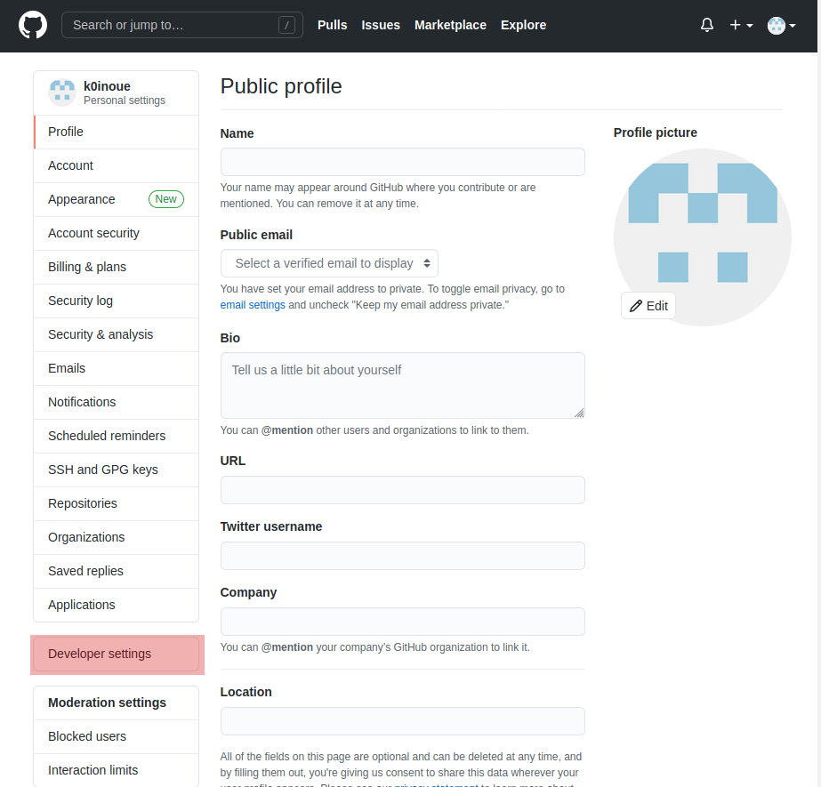
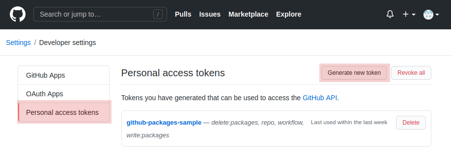
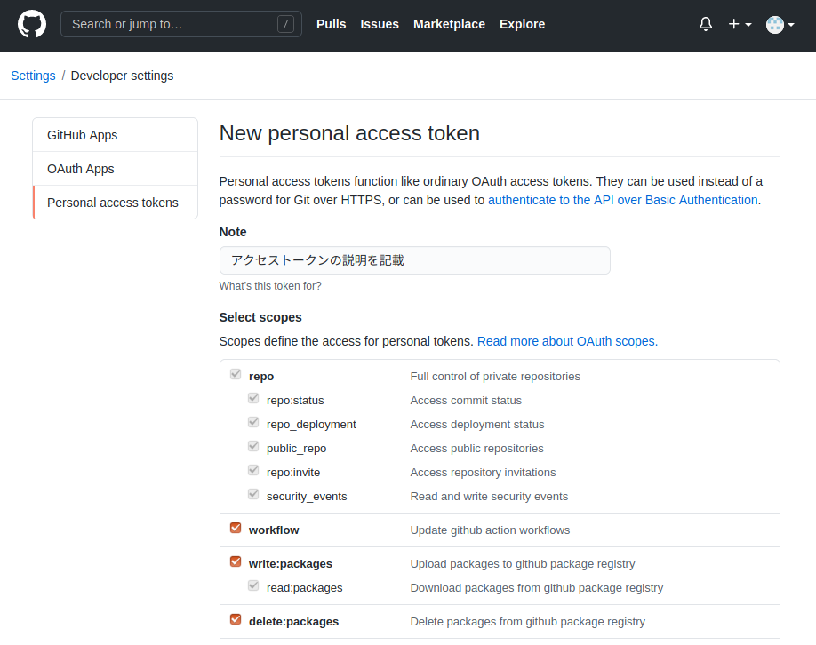
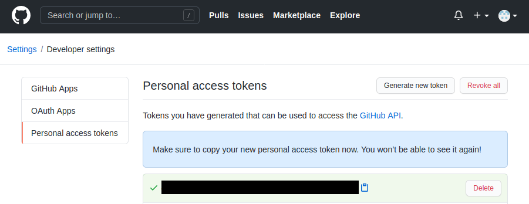

# github-packages-sample

GitHub PackagesにDockerのイメージを登録して利用するサンプルプロジェクト。

## 手順概略
GitHub PackagesでDockerのイメージを利用する大まかな手順は以下となる。

1. [こちらのページ](https://github.com/settings/tokens)から、GitHubのPersonal access tokensを生成する
    - 以下のスコープにチェックを入れること
        - write:packages
        - delete:packages
2. 生成したPersonal access tokenの値をローカルファイルに保存しておく
    - 本リポジトリではリポジトリルート直下の'.github-token'に保存する想定
3. `docker build`でイメージを作成する
4. `docker login`でGitHubにログインする
5. `docker tag`で作成したイメージにタグ付けをしてリポジトリとも紐付ける
6. `docker push`でリポジトリへイメージをアップロードする
7. `docker pull`でリポジトリからイメージを取得する(pullするのにもaccess tokenが必要)

本プロジェクトでは、便宜上、手順3〜7を行うためのスクリプトを用意している。

## ファイル構成
本リポジトリのファイル構成は以下となる。

```
github-packages-sample/
|-- .gitignore
|-- LICENSE
|-- README.md
|-- build.sh            Dockerビルドスクリプト
|-- config.sh           シェルスクリプト共用設定ファイル
|-- docker/             サンプルのDockerプロジェクト
|   |-- Dockerfile
|-- login.sh            GitHubへのログインスクリプト
|-- pull.sh             GitHubからイメージをpullするスクリプト
|-- push.sh             GitHubへのイメージをpushするスクリプト
```

リポジトリとは別に、アクセストークンを保存したファイルを以下に置いている想定。

```
$HOME/
|-- .github-token       GitHub Packagesにアクセスするためのトークン(各自用意)
```

## 手動による手順詳細

### Personal access tokensの生成
[こちらのページ](https://github.com/settings/tokens)から、GitHubのPersonal access tokensを生成する。

1. \[Develops settings\]
---



2. \[Personal access tokens\] --> \[Generate new token\]
---



3. \[Select scopes\]
---

以下にチェックを入れて、ページ下部にある、\[Generate token\]をクリック。

- write:packages
- read:packages
- delete:packages



4. 生成されたトークンを保存
---

生成されたトークン(下の画像の黒塗り部分)をコピーして、`$HOME/.github-token`に保存する。




念の為、自分以外は読み書きできない権限に変更しておく。

```
chmod 600 $HOME/.github-token
```

### Dockerコマンドによる操作

各手順のdockerコマンドは以下の通り。

```
# ビルド
docker build -t ローカルのイメージ名 -f ビルドするDockerfileパス .

# ログイン
cat .github-token | docker login docker.pkg.github.com --username GitHubユーザ名 --password-stdin

# タグ付け
docker tag ローカルのイメージ名 docker.pkg.github.com/GitHubユーザ名/リポジトリ名/配布パッケージ名:タグ

# アップロード(push)
docker push docker.pkg.github.com/GitHubユーザ名/リポジトリ名/配布パッケージ名:タグ

# ダウンロード(pull)
docker pull docker.pkg.github.com/GitHubユーザ名/リポジトリ名/配布パッケージ名:タグ
```

Dockerfile内で指定する場合は以下となる。

```
FROM docker.pkg.github.com/GitHubユーザ名/リポジトリ名/配布パッケージ名:タグ
```

### 簡略用シェルスクリプト

プロジェクトのルートディレクトリに移動して、以下を実行。
(各スクリプトは`chmod +x cmd/*.sh`などで実行権限を追加しておくこと)

```
cmd/build.sh  [<タグ>]      # Dockerfileをビルドする
cmd/push.sh   [<タグ>]      # ログインして、タグ付けして、pushする
cmd/pull.sh   [<タグ>]      # イメージをpullする
cmd/login.sh                # docker login コマンドでgithubにログイン
```

タグを省略すると、`latest`になる。


### 簡略用シェルスクリプト用の設定ファイル

以下の変数を`config.sh`で設定しており、各スクリプトから読み込んでいる。
プロジェクトに合わせて設定すること。

```
# GitHubのユーザ名(リポジトリパスに含まれる)
GITHUB_USER=k0inoue

# GitHubのリポジトリ名(リポジトリパスに含まれる)
GITHUB_REPOSITORY=github-packages-sample

# 配布パッケージ名(Dockerのイメージ名となる)
PACKAGE_NAME=gpack-sample

# GitHubのPersonal access tokensを保存したファイルのパス
GITHUB_TOKEN_FILE=.github-token

# ビルドするDockerfileパス
DOCKER_FILE_PATH=docker/Dockerfile
```

## 注意点

- DockerイメージをpullするのにもPersonal access tokensによる認証が必要
    - 各自のアカウントで「read:packages」にチェックを入れたトークンがあればOK


